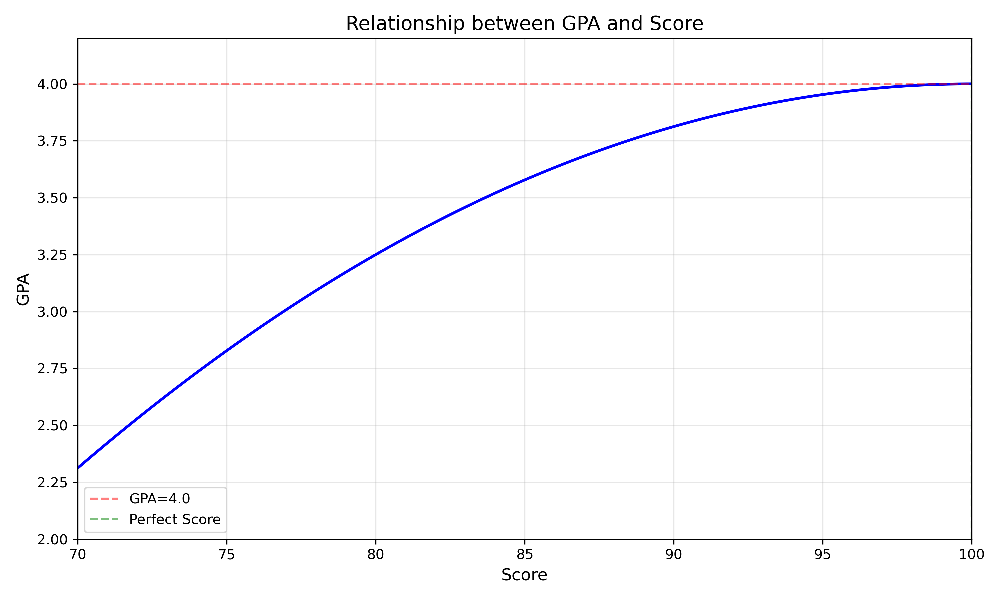

**Transcripts Printing Date: 2025.11.21**

GPA(x) = 4-3*(100-x)2/1600

+ Overall GPA: 3.52/4.0 (cohort of 220 students; cohort highest GPA: 3.88/4.0)
+ Rank: approximately 30% (not sure, see [[ranking_explain_by_PKU](https://luoxiaogan.github.io/GanLuo.github.io/Transcript_and_Enrollment/ranking_explain.pdf)])

  

+ https://luoxiaogan.github.io/GanLuo.github.io/Transcript_and_Enrollment/Transcript_Chinese.pdf

+ https://luoxiaogan.github.io/GanLuo.github.io/Transcript_and_Enrollment/Transcript_English.pdf

+ https://luoxiaogan.github.io/GanLuo.github.io/Transcript_and_Enrollment/Certificate_of_Enrollment.pdf

+ https://luoxiaogan.github.io/GanLuo.github.io/Transcript_and_Enrollment/ranking_explain.pdf 